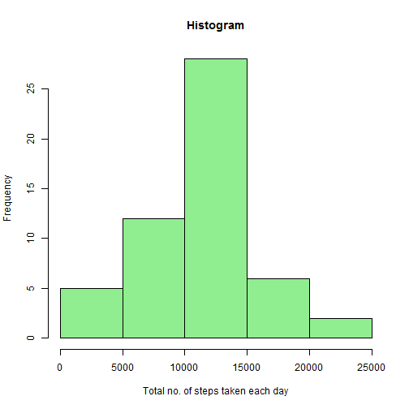
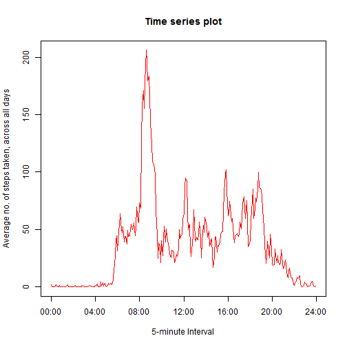
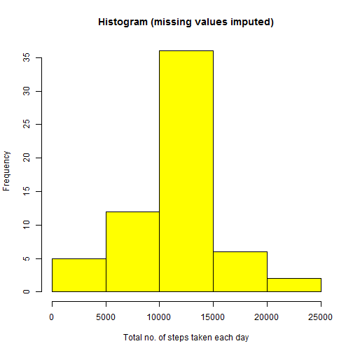
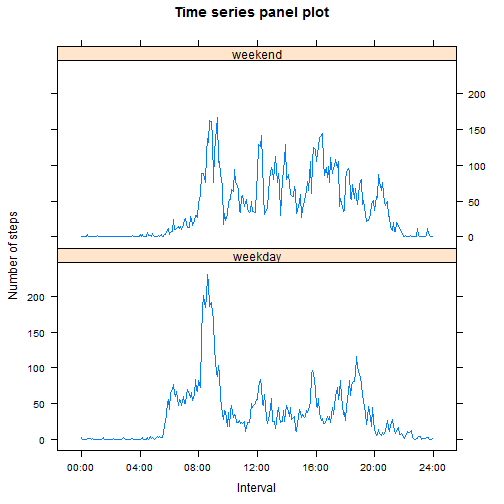

## Loading and preprocessing the data

Set working directory, unzip and read data from the unzipped csv file 'activity.csv'


```r
unzip("activity.zip")
my_data <- read.csv("activity.csv", header = TRUE, na.strings = "NA")
names(my_data) <- c("Steps", "Date", "Interval")
summary(my_data)
```

```
##      Steps                Date          Interval     
##  Min.   :  0.00   2012-10-01:  288   Min.   :   0.0  
##  1st Qu.:  0.00   2012-10-02:  288   1st Qu.: 588.8  
##  Median :  0.00   2012-10-03:  288   Median :1177.5  
##  Mean   : 37.38   2012-10-04:  288   Mean   :1177.5  
##  3rd Qu.: 12.00   2012-10-05:  288   3rd Qu.:1766.2  
##  Max.   :806.00   2012-10-06:  288   Max.   :2355.0  
##  NA's   :2304     (Other)   :15840
```

From the summary, it is noted that there are NA values in the original dataset.

Load library for 'dplyr'


```r
library(dplyr)
```

From visual inspection, I noted that NA values occur on 'missed days' only.

Remove NA values from dataset.


```r
nonNA_data <- filter(my_data, !is.na(Steps))
```

## What is mean total number of steps taken per day?

Sum up total number of steps taken per day.


```r
by_date <- group_by(nonNA_data, Date)
my_agg <- summarize(by_date, sum(Steps))
names(my_agg) <- c("Date", "Total_Steps")
```

Plot histogram of the total number of steps taken each day.


```r
hist(my_agg$Total_Steps, col = "light green", main = "Histogram", xlab = "Total no. of steps taken each day")
```

 

Calculate the mean and median of total number of steps taken per day.


```r
mean(my_agg$Total_Steps)
```

```
## [1] 10766.19
```

```r
median(my_agg$Total_Steps)
```

```
## [1] 10765
```

## What is the average daily activity pattern?

Compute average number of steps taken for the 5-minute interval, averaged across all days


```r
by_interval <- group_by(nonNA_data, Interval)
my_avg <- summarize(by_interval, mean(Steps))
names(my_avg) <- c("Interval", "Avg_Steps")
```

From the dataset, it is noted that the 'interval' is not a continuous series. As such, I am converting the '5-minute intervals' to a linear scale (0 to 287) to represent 288 x '5-minute intervals' in 24-hours, and then overlay the x-axis with customised time labels. Make a time series plot of the 5-minute interval (x-axis) and the average number of steps taken, averaged across all days (y-axis)


```r
my_interval <- c(0:287)
my_df <- cbind(my_avg, my_interval)
names(my_df) <- c("Interval", "Avg_Steps", "My_Interval")

with(my_df, plot(My_Interval, Avg_Steps, type = "l", xaxt = "n", col = "red", main = "Time series plot", 
                 xlab = "5-minute Interval", ylab = "Average no. of steps taken, across all days"))

my_xlab <- c("00:00", "04:00", "08:00", "12:00", "16:00", "20:00", "24:00")
axis(1, at=c(0, 48, 96, 144, 192, 240, 288), labels = my_xlab)
```

 

Calculate which of the 5-minute intervals contains the maximum number of steps, on average across all the days in the dataset.


```r
y <- max(my_avg$Avg_Steps)
my_avg[my_avg$Avg_Steps == y, ]
```

```
## Source: local data frame [1 x 2]
## 
##   Interval Avg_Steps
## 1      835  206.1698
```

## Imputing missing values

Calculate the total number of missing values in the original dataset.


```r
sum(is.na(my_data$Steps))
```

```
## [1] 2304
```

To fill the missing values in the original dataset, use the mean for that 5-minute interval (i.e. the average number of steps taken for that 5-minute interval, averaged across all days).  


```r
NA_data <- filter(my_data, is.na(Steps))
mergedData <- merge(NA_data, my_avg, by.x = "Interval", by.y = "Interval")

imputeData <- mergedData %>%
                mutate(Steps = Avg_Steps) %>%
                select(Steps, Date, Interval)

new_data <- rbind(imputeData, nonNA_data)
new_data <- arrange(new_data, Date, Interval)
summary(new_data)
```

```
##      Steps                Date          Interval     
##  Min.   :  0.00   2012-10-01:  288   Min.   :   0.0  
##  1st Qu.:  0.00   2012-10-02:  288   1st Qu.: 588.8  
##  Median :  0.00   2012-10-03:  288   Median :1177.5  
##  Mean   : 37.38   2012-10-04:  288   Mean   :1177.5  
##  3rd Qu.: 27.00   2012-10-05:  288   3rd Qu.:1766.2  
##  Max.   :806.00   2012-10-06:  288   Max.   :2355.0  
##                   (Other)   :15840
```

From the summary, it is noted that there is no more NA value in the new dataset. 

Process new dataset to sum up the total number of steps taken per day.


```r
by_date2 <- group_by(new_data, Date)
my_agg2 <- summarize(by_date2, sum(Steps))
names(my_agg2) <- c("Date", "Total_Steps")
```

Plot histogram of the total number of steps taken each day.


```r
hist(my_agg2$Total_Steps, col = "Yellow", main = "Histogram (missing values imputed)", 
     xlab = "Total no. of steps taken each day")
```

 

Calculate the mean and median of the total number of steps taken per day.


```r
mean(my_agg2$Total_Steps)
```

```
## [1] 10766.19
```

```r
median(my_agg2$Total_Steps)
```

```
## [1] 10766.19
```

## Are there differences in activity patterns between weekdays and weekends?

Create a new variable in the dataset 'new_data' to indicate 'weekday' or 'weekend'.


```r
new_data <- mutate(new_data, Dayofweek = weekdays(as.Date(Date)))

new_data <- mutate(new_data, Dayfactor = ifelse((Dayofweek == "Saturday")|
                                                  (Dayofweek == "Sunday"), "weekend", "weekday"))
```

Compute the average no. of steps taken for the 5-minute interval, averaged across all 'weekday' days or 'weekend' days.


```r
by_day_interval <- group_by(new_data, Dayfactor, Interval)
new_avg <- summarize(by_day_interval, mean(Steps))
names(new_avg) <- c("Day_Type", "Interval", "Avg_Steps")
```

Load library for 'lattice'


```r
library(lattice)
```

Similar to previous 'time series plot', convert the '5-minute interval to a linear scale (0 to 287) to represent 288 x '5-minute intervals' in 24-hours, and then overlay the x-axis with customised time labels.Make a panel plot containing a time series plot of the 5-minute interval (x-axis) and the average no. of steps taken, averaged across all weekday days or weekend days (y-axis).


```r
my_interval2 <- rep(c(0:287))
my_df2 <- cbind(new_avg, my_interval2)
names(my_df2) <- c("Day_Type", "Interval", "Avg_Steps", "My_Interval")

x_at <- c(0, 48, 96, 144, 192, 240, 288)
my_xlab <- c("00:00", "04:00", "08:00", "12:00", "16:00", "20:00", "24:00")

xyplot(Avg_Steps ~ My_Interval | Day_Type, data = my_df2, layout = c(1, 2), type = "l", 
       main = "Time series panel plot", xlab = "Interval", ylab = "Number of steps", 
       scales = list(x = list(at = x_at, labels = my_xlab)))
```

 
